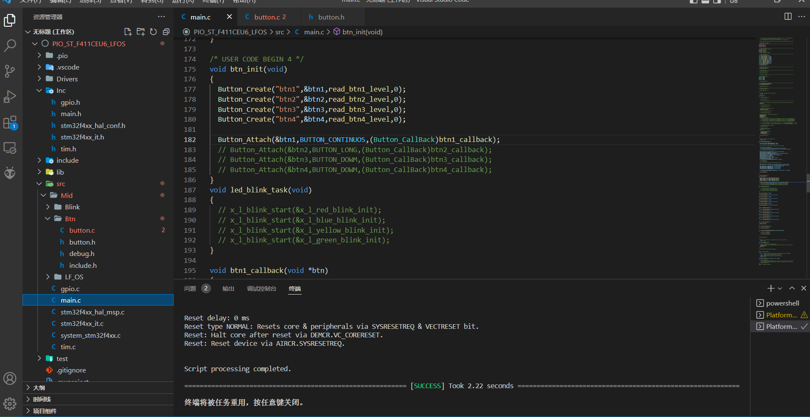
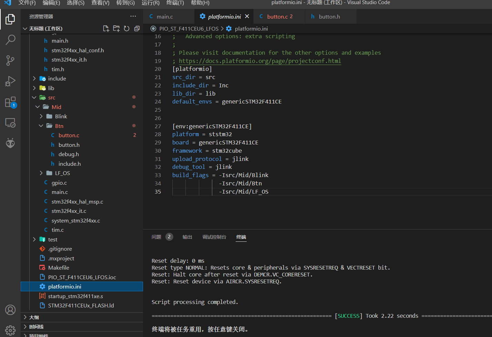
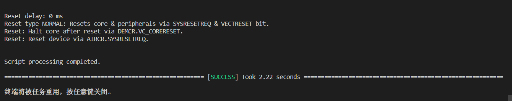
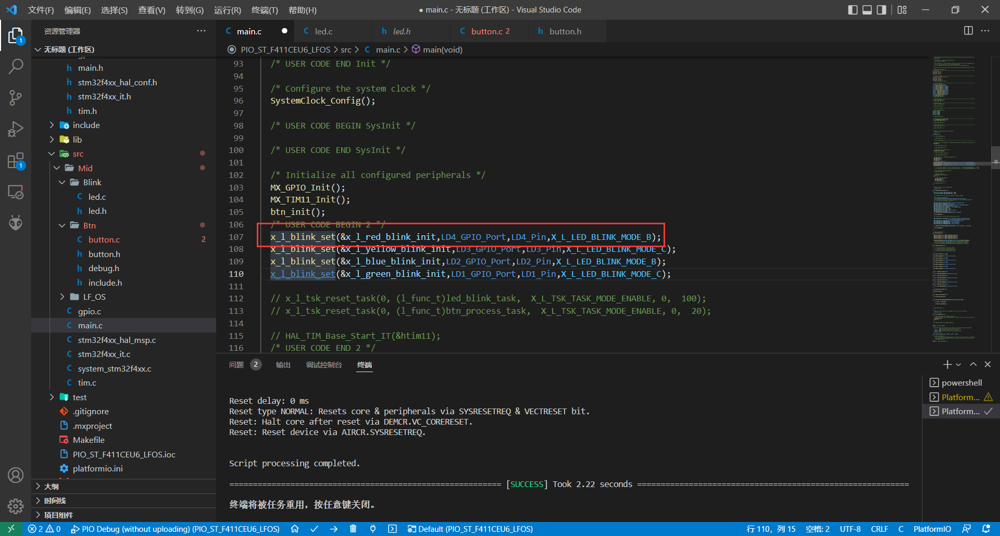
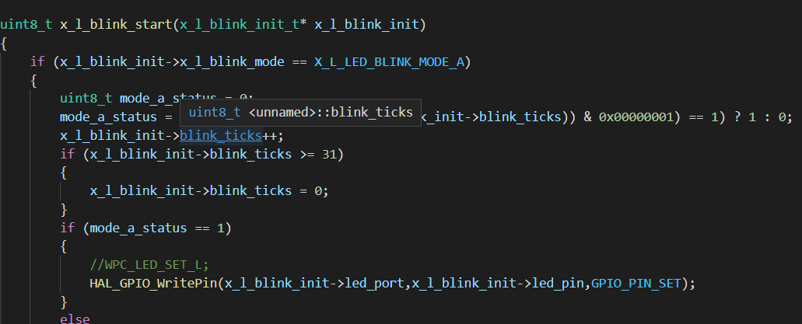
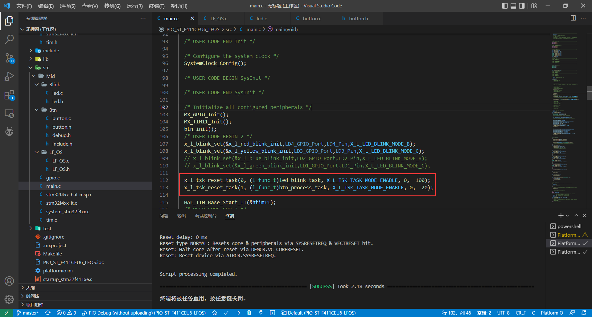
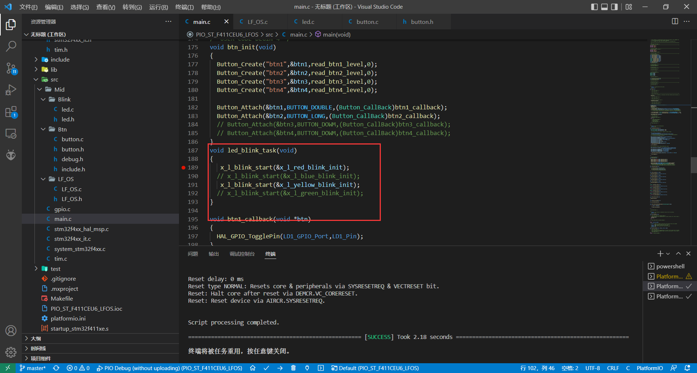
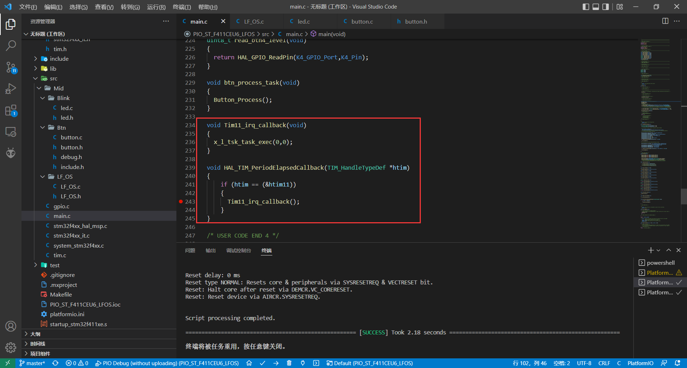

# 一.按照环境搭建的教程搭建好开发环境

PlatformIO的工程结构如下



platformio.ini文件内容如下



编译成功后，调用各库无误



# 二.移植程序块

## 1.闪灯程序

源于E-BATTLE系列wpc的闪灯程序

```c_cpp
x_l_blink_init_t x_l_red_blink_init;
x_l_blink_init_t x_l_yellow_blink_init;
x_l_blink_init_t x_l_blue_blink_init;
x_l_blink_init_t x_l_green_blink_init;
```

首先初始化灯闪的结构体信息，包含IO的Port，pin，以及灯闪模式

```c_cpp
typedef enum
{
	X_L_LED_ON           = 0,
	X_L_LED_OFF,
	X_L_LED_BLINK_MODE_A,
	X_L_LED_BLINK_MODE_B,
	X_L_LED_BLINK_MODE_C,
}x_l_blink_mode_t;
//灯闪模式
typedef struct
{
	GPIO_TypeDef* led_port;
	uint32_t led_pin;
	uint8_t blink_ticks;
	x_l_blink_mode_t x_l_blink_mode;	
}x_l_blink_init_t;
//闪灯的结构体信息
```

在初始化部分，初始话LED信息结构体



最终循环调用执行程序



## 2.按键程序

参考readme.md

D:\Workspace\VS\MultiBtn

或者直接github找答案

https://github.com/Kevincoooool/ButtonDrive

## 3.移植操作系统

初始化任务函数



添加回调函数



周期调度执行



# 三.实现效果

最终可以实现LD3、LD4交替闪烁，K1双击使得LD1反转，K2长按使得LD2反转

参考代码链接：

https://github.com/hit-wpc/LF_OS